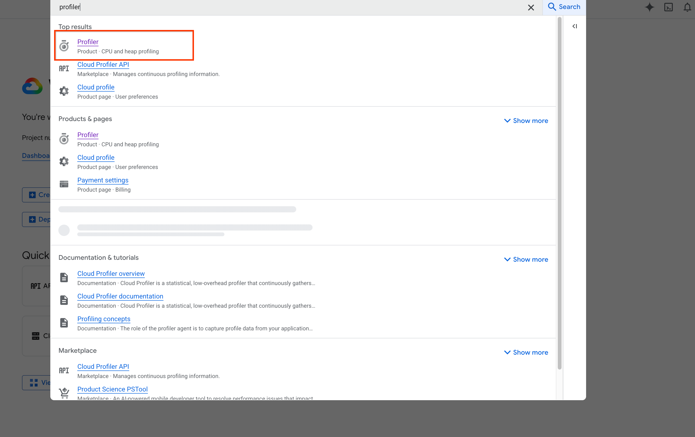
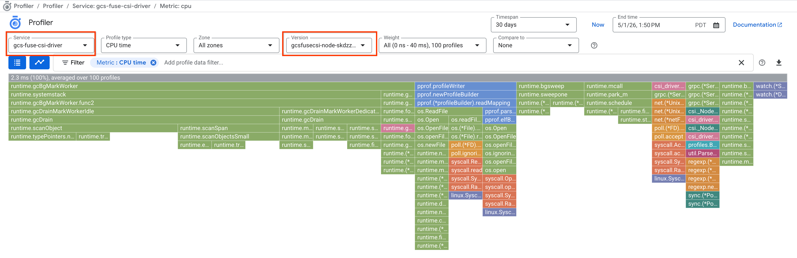
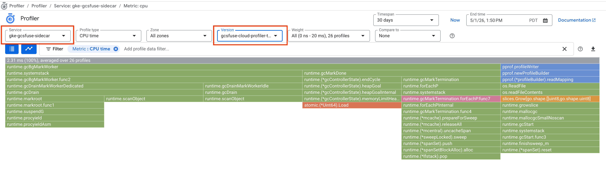
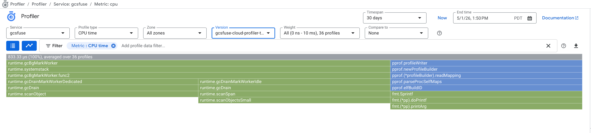
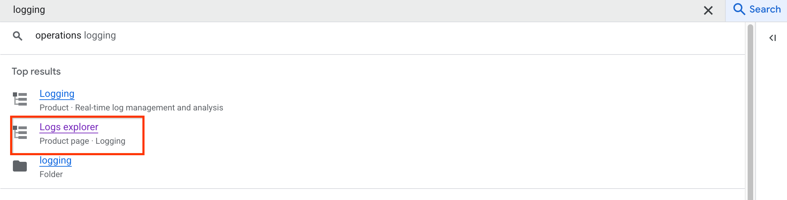
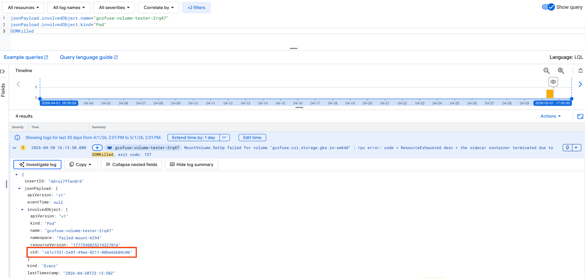
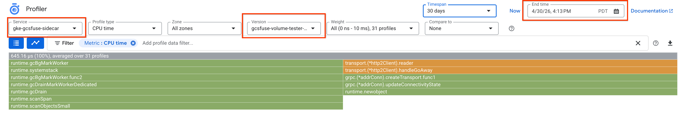

# Cloud Profiler Integration for GCSFuse CSI Driver

This document explains how to enable and use [Cloud Profiler](https://cloud.google.com/profiler) to monitor the CPU and memory usage of the GCSFuse CSI Driver and its sidecar containers. This is particularly useful for debugging Out-Of-Memory (OOM) kills and identifying memory leaks.

## Prerequisites

Before using Cloud Profiler, you must enable the required API and configure the necessary IAM permissions.

Note: Cloud Profiler cannot retrospectively collect or display data from before it was fully enabled. You must enable the Cloud Profiler API and configure the required IAM permissions *before* the issue occurs to successfully capture profiling data.

### 1. Enable the Cloud Profiler API

Enable the Cloud Profiler API in your Google Cloud project:

```bash
gcloud services enable cloudprofiler.googleapis.com
```

### 2. Configure IAM Permissions

You need to grant the `roles/cloudprofiler.agent` role to the appropriate service accounts depending on which components you want to profile.

**For the Node Driver:**
Because the node driver uses host networking, it authenticates using the GKE Node's default service account rather than the Pod's Kubernetes Service Account (KSA). You must grant the role to the node's service account:

```bash
gcloud projects add-iam-policy-binding <project-id> \
    --role=roles/cloudprofiler.agent \
    --member=serviceAccount:<project-number>-compute@developer.gserviceaccount.com
```

**For the Sidecar and GCSFuse Process:**
To generate usage profiles for the sidecar, the user pod's KSA needs the `cloudprofiler.agent` role. Assuming you are using Workload Identity:

```bash
gcloud projects add-iam-policy-binding projects/<project-id> \
    --role=roles/cloudprofiler.agent \
    --member=principal://iam.googleapis.com/projects/<project-id>.svc.id.goog/subject/ns/<user-namespace>/sa/<user-pod-ksa> \
    --condition=None
```

Note: If your workload pod uses the host network but does not use the GCSFuse CSI Token Volume Injection feature, you must instead grant the `cloudprofiler.agent` role directly to the underlying Node's service account.

## Enabling Cloud Profiler

### Node Driver
For both Managed and Non-managed GCSFuse CSI drivers, Cloud Profiler for the node driver component is enabled by default. No further action is required in the Pod specification.

### Sidecar Container (Opt-in)
Cloud Profiler for the sidecar is an opt-in feature. To enable Cloud Profiler for the native sidecar container, include the `enableCloudProfilerForSidecar: "true"` volume attribute in your Pod spec:

```yaml
volumes:
  - name: gcs-fuse-csi-ephemeral
    csi:
      driver: gcsfuse.csi.storage.gke.io
      volumeAttributes:
        bucketName: test-bucket
        enableCloudProfilerForSidecar: "true"
```

## Viewing Profiler Data

To analyze the profiles, navigate to the **Cloud Profiler** page in the Google Cloud Console. 


You can filter the results by **Service Name** depending on the component you are investigating:

*   **Node Driver:** Filter by service `gcs-fuse-csi-driver`.

*   **Sidecar Mounter:** Filter by service `gke-gcsfuse-sidecar`.

*   **GCSFuse:** Filter by service `gcsfuse`.


The sidecar mounter automatically manages the Cloud Profiler versioning using the format `<pod_name>_<pod_uid>`. This ensures each instance is uniquely identified even across pod restarts.

## Troubleshooting: Correlating OOM Events with Profiler

When a Pod experiences an OOM kill, you can easily correlate the event to the correct Cloud Profiler snapshot using the following workflow:

1.  **Check Cloud Logging Explorer:** Navigate to Cloud Logging Explorer to find the Kubernetes OOM Event.

2.  **Filter by Pod Name:** Run the following query to locate the event logs for your specific pod:
    ```text
    jsonPayload.involvedObject.name="<pod_name>" 
    jsonPayload.involvedObject.kind="Pod"
    OOMKilled
    ```
    *(Note: If the sidecar mounter or GCSFuse process OOMs, the pod name is the workload pod's name. If the node driver OOMs, it will be `gcsfusecsi-node-*`)*.
3.  **Extract the Pod UID:** Expand the relevant OOM event log and note down the timestamp and the exact Pod UID located at `jsonPayload.involvedObject.uid`.

4.  **Analyze in Cloud Profiler:** Navigate to Cloud Profiler, select the appropriate **Service Name** for the component you are investigating (see the list in the Viewing Profiler Data section), filter the **Service Version** using the `<pod_name>_<uid>` format, and adjust the time range to match the OOM timestamp. This guarantees you are looking at the exact memory profile of the specific container instance right before it was killed.

