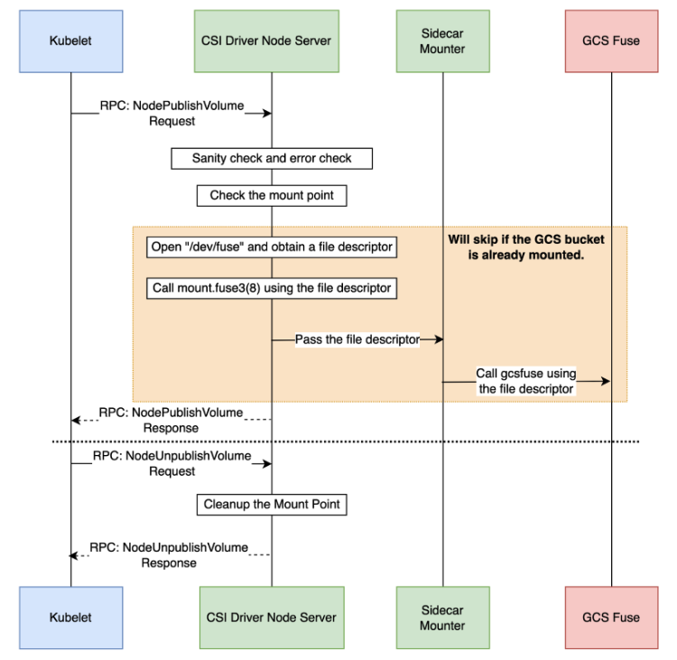

<!--
Copyright 2018 The Kubernetes Authors.
Copyright 2025 Google LLC

Licensed under the Apache License, Version 2.0 (the "License");
you may not use this file except in compliance with the License.
You may obtain a copy of the License at

    https://www.apache.org/licenses/LICENSE-2.0

Unless required by applicable law or agreed to in writing, software
distributed under the License is distributed on an "AS IS" BASIS,
WITHOUT WARRANTIES OR CONDITIONS OF ANY KIND, either express or implied.
See the License for the specific language governing permissions and
limitations under the License.
-->
# Fuse design snippets

## Fuse CSI mount mechanics

GCSFuse CSI implements a unique design where the gcsfuse util resides in a sidecar container injected into the workload pod spec. This has several benefits:
1. No additional fuse dependencies need to be installed on the k8s node
2. Since fuse runs in the context of the user pod, auth works out of the box. For any GCS API calls initiated by gcsfuse, the auth and token exchange is seamlessly handled by workload identity server running on the node.
3. Workload pod does not need a [privileged](https://kubernetes.io/docs/tasks/configure-pod-container/security-context/) mode to initiate the fuse mount.
4. Once the volume has been mounted, the workload pod is immune to any CSI driver pod restart. This is because the gcsfuse process runs inside the sidecar container of the workload pod.

### Two step fuse mount

Below snippet shows the sequence for the two step mount process that is split between the CSI node driver pod and the gke-gcsfuse-sidecar container (which hosts the gcsfuse). The key steps:
- the CSI node driver is responsible for opening the /dev/fuse file descriptor and calling the [linux mount with fd=N](https://github.com/GoogleCloudPlatform/gcs-fuse-csi-driver/blob/v19.3/pkg/csi_mounter/csi_mounter.go#L104) option. CSI driver node then [listens for a connection request](https://github.com/GoogleCloudPlatform/gcs-fuse-csi-driver/blob/v19.3/pkg/csi_mounter/csi_mounter.go#L168) from sidecar container. Once the sidecar initiates communication, the fd is then [handed off](https://github.com/GoogleCloudPlatform/gcs-fuse-csi-driver/blob/v19.3/pkg/csi_mounter/csi_mounter.go#L334) to the gcsfuse sidecar which completes the mount.

- the sidecar during its bootstrap communicates with the CSI node driver over a well known [Unix domain socket path](https://github.com/GoogleCloudPlatform/gcs-fuse-csi-driver/blob/v19.3/cmd/sidecar_mounter/main.go#L62), obtains the file descriptor information and [invokes gcsfuse process](https://github.com/GoogleCloudPlatform/gcs-fuse-csi-driver/blob/v19.3/pkg/sidecar_mounter/sidecar_mounter.go#L129C1-L137C1) with the "/dev/fd/3" extraFiles option

