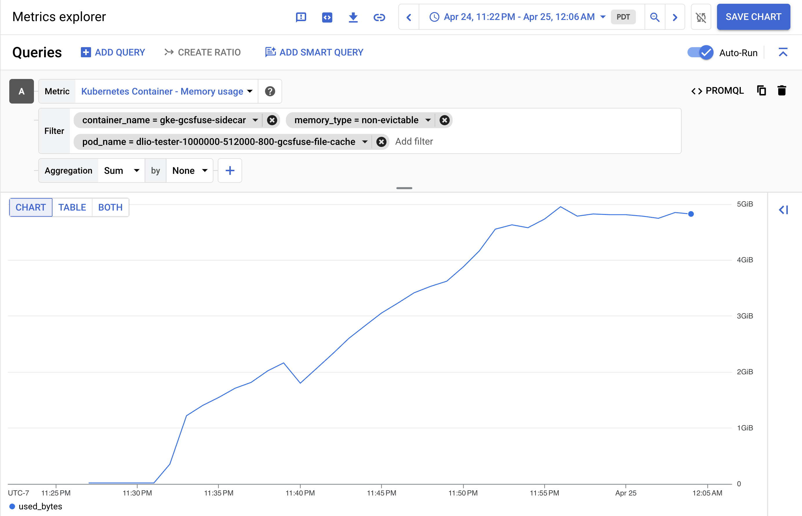
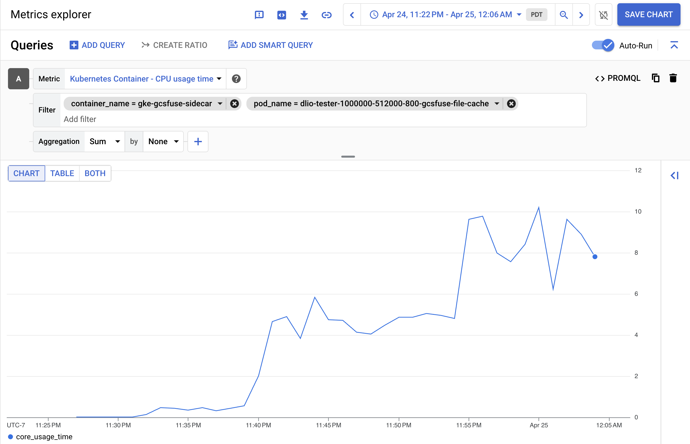
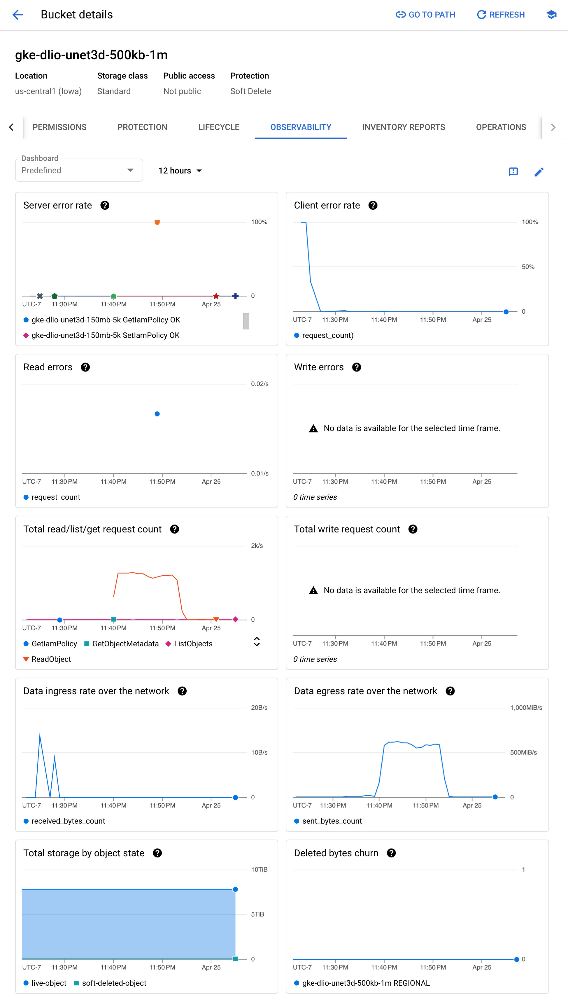

<!--
Copyright 2018 The Kubernetes Authors.
Copyright 2022 Google LLC

Licensed under the Apache License, Version 2.0 (the "License");
you may not use this file except in compliance with the License.
You may obtain a copy of the License at

    https://www.apache.org/licenses/LICENSE-2.0

Unless required by applicable law or agreed to in writing, software
distributed under the License is distributed on an "AS IS" BASIS,
WITHOUT WARRANTIES OR CONDITIONS OF ANY KIND, either express or implied.
See the License for the specific language governing permissions and
limitations under the License.
-->

# Monitoring

## Sidecar container resource usage

Cloud Storage FUSE instances run inside sidecar containers and mount Cloud Storage buckets for your workload. To ensure the Cloud Storage FUSE instances run properly, it is important to monitor the sidecar container resource consumption. To learn more about how to configure the sidecar container resource allocation, see GKE documentation [Configure resources for the sidecar container](https://cloud.google.com/kubernetes-engine/docs/how-to/persistent-volumes/cloud-storage-fuse-csi-driver#sidecar-container-resources).

You can use [GCP Metrics Explorer](https://cloud.google.com/monitoring/charts/metrics-explorer) to check the sidecar container resource usage. Use the following filters:

### Memory usage

Insufficient memory will cause Cloud Storage FUSE out-of-memory errors and crash the workload application. Ensure the sidecar container memory limit is large enough, or leave the memory limit unset to allow the Cloud Storage FUSE to consume all the available resources on a node.

- Metric: Kubernetes Container - Memory usage (kubernetes.io/container/memory/used_bytes)

- Filter:
  - memory_type = non-evictable
  - container_name = gke-gcsfuse-sidecar
  - pod_name = your-pod-name
- For example: 

### CPU usage time

Insufficient CPU will cause Cloud Storage FUSE throttling and lead to unsatisfying performance. Ensure the sidecar container CPU limit is large enough, or leave the CPU limit unset to allow the Cloud Storage FUSE to consume all the available resources on a node.

- Metric: Kubernetes Container - CPU usage time (kubernetes.io/container/cpu/core_usage_time)
- Filter:
  - container_name = gke-gcsfuse-sidecar
  - pod_name = your-pod-name
- For example: 

## Cloud Storage bucket observability

To check metrics of Cloud Storage buckets, go to the bucket page, and click the `OBSERVABILITY` tab. For example: 

### Total read/list/get request count

This chart shows total requests issued by the Cloud Storage FUSE for Read, List, Get. If the `GetObjectMetadata` request is observed throughout your workload, consider enabling the Cloud Storage FUSE metadata cache and increasing the cache capacity. For more information, refer to the [troubleshooting guide](./troubleshooting.md#metadata-cache).

### Data egress rate over the network

This chart presents an approximate representation of the object download speed from Cloud Storage FUSE. If the throughput is inadequate, you can refer to the [performance troubleshooting steps](./troubleshooting.md#performance-issues) for guidance on tuning Cloud Storage FUSE to improve its performance.

## Cloud Storage FUSE metrics

Cloud Storage FUSE supports exporting [custom metrics](https://github.com/GoogleCloudPlatform/gcsfuse/blob/master/docs/metrics.md) to Google cloud monitoring. Currently, these metrics are not available on GKE. GKE is working on integrating these metrics with the CSI driver.
