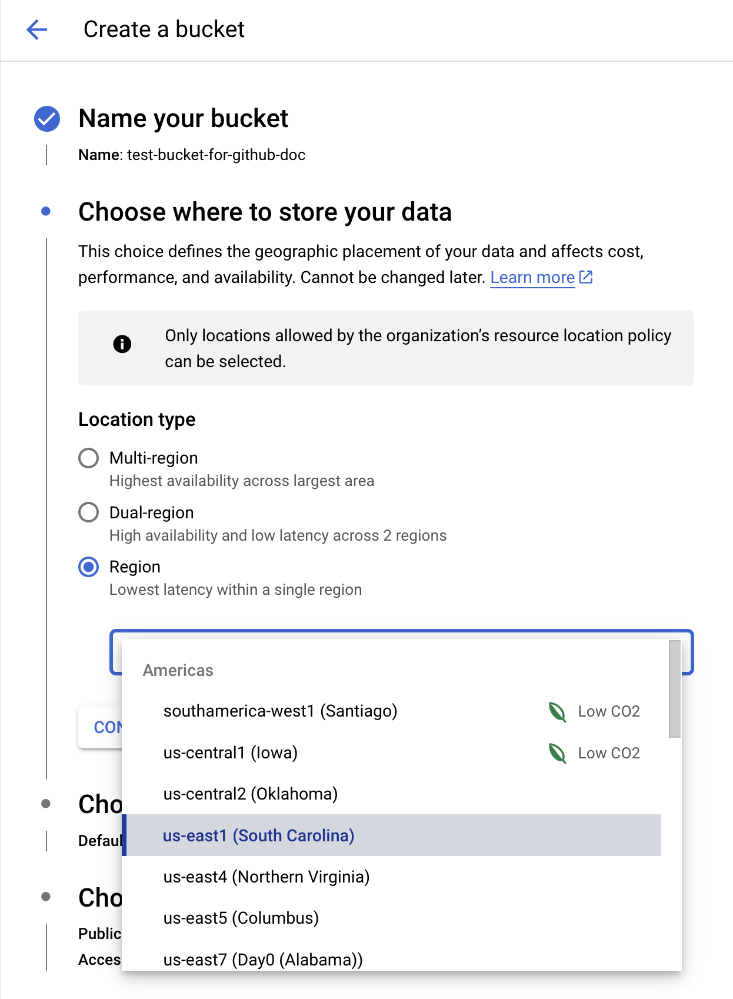

<!--
Copyright 2018 The Kubernetes Authors.
Copyright 2022 Google LLC

Licensed under the Apache License, Version 2.0 (the "License");
you may not use this file except in compliance with the License.
You may obtain a copy of the License at

    https://www.apache.org/licenses/LICENSE-2.0

Unless required by applicable law or agreed to in writing, software
distributed under the License is distributed on an "AS IS" BASIS,
WITHOUT WARRANTIES OR CONDITIONS OF ANY KIND, either express or implied.
See the License for the specific language governing permissions and
limitations under the License.
-->

# Troubleshooting

## Log queries

Run the following queries on [GCP Logs Explorer](https://cloud.google.com/logging/docs/view/logs-explorer-interface) to check logs.

- Sidecar container and gcsfuse logs:

    ```text
    resource.type="k8s_container"
    resource.labels.container_name="gke-gcsfuse-sidecar"
    resource.labels.pod_name=your-pod-name"
    ```

- Cloud Storage FUSE CSI Driver logs:

    ```text
    resource.type="k8s_container"
    resource.labels.container_name="gcs-fuse-csi-driver"
    ```

- Cloud Storage FUSE CSI Driver Webhook logs (only for manual installation users):

    ```text
    resource.type="k8s_container"
    resource.labels.container_name="gcs-fuse-csi-driver-webhook"
    ```

## New features availability

To use the Cloud Storage FUSE CSI driver and specific feature or enhancement, your clusters must meet the specific requirements. See the [GKE documentation](https://cloud.google.com/kubernetes-engine/docs/how-to/persistent-volumes/cloud-storage-fuse-csi-driver#requirements) for these requirements.

## I/O errors in your workloads

- Error `Transport endpoint is not connected` in workload Pods.
  
  This error is due to Cloud Storage FUSE termination. In most cases, Cloud Storage FUSE was terminated because of OOM. Use the Pod annotations `gke-gcsfuse/[cpu-limit|memory-limit|ephemeral-storage-limit]` to allocate more resources to Cloud Storage FUSE (the sidecar container). Note that the only way to fix this error is to restart your workload Pod.

- Error `Permission denied` in workload Pods.
  
  Cloud Storage FUSE does not have permission to access the file system.
  
  Double check your container `user` and `fsGroup`. If you use a [Security Context](https://kubernetes.io/docs/tasks/configure-pod-container/security-context/) for your Pod or container, or if your container image uses a non-root user or group, you must set the `uid` and `gid` mount flags. You also need to use the `file-mode` and `dir-mode` mount flags to set the file system permissions. See [Configure how Cloud Storage FUSE buckets are mounted](https://cloud.google.com/kubernetes-engine/docs/how-to/persistent-volumes/cloud-storage-fuse-csi-driver#considerations) for more details.
  
  Double check your service account setup. See [Configure access to Cloud Storage buckets using GKE Workload Identity](./authentication.md) for more details.

- Error `gcs.PreconditionError: googleapi: Error 412: The type of authentication token used for this request requires that Uniform Bucket Level Access be enabled` during writes to the bucket

If using [Workload Identity Federation](https://cloud.devsite.corp.google.com/kubernetes-engine/docs/concepts/workload-identity), gcsfuse may complain when performing writes. A sample error `CreateObject(\"foo\") (117.594269ms): gcs.PreconditionError: googleapi: Error 412: The type of authentication token used for this request requires that Uniform Bucket Level Access be enabled., conditionNotMet"}`. To fix this, [enable uniform bucket-level-access](https://cloud.google.com/storage/docs/using-uniform-bucket-level-access#set) on the given bucket.

## Pod event warnings

If your workload Pods cannot start up, run `kubectl describe pod <your-pod-name> -n <your-namespace>` to check the Pod events. Find the troubleshooting guide below according to the Pod event.

### CSI driver enablement issues

- Pod event warning examples:

  - > MountVolume.MountDevice failed for volume "xxx" : kubernetes.io/csi: attacher.MountDevice failed to create newCsiDriverClient: driver name gcsfuse.csi.storage.gke.io not found in the list of registered CSI drivers

  - > MountVolume.SetUp failed for volume "xxx" : kubernetes.io/csi: mounter.SetUpAt failed to get CSI client: driver name gcsfuse.csi.storage.gke.io not found in the list of registered CSI drivers

- Solutions:

  This warning indicates that the CSI driver is not enabled, or the CSI driver is not up and running. Double check if the CSI driver is enabled on your cluster. See [Enable the Cloud Storage FUSE CSI driver](https://cloud.google.com/kubernetes-engine/docs/how-to/persistent-volumes/cloud-storage-fuse-csi-driver#enable) for details. If the CSI is enabled, on each node you should see a Pod called `gcsfusecsi-node-xxxxx` up and running. If the cluster was just scaled, updated, or upgraded, this warning is normal and should be transient because it takes a few minutes for the CSI driver Pods to be functional after the cluster operations.

### MountVolume.SetUp failures

> Note: the rpc error code can be used to triage `MountVolume.SetUp` issues. For example, `Unauthenticated` and `PermissionDenied` usually mean the authentication was not configured correctly. A rpc error code `Internal` means that unexpected issues occurred in the CSI driver, create a [new issue](https://github.com/GoogleCloudPlatform/gcs-fuse-csi-driver/issues/new) on the GitHub project page.

#### Unauthenticated

- Pod event warning examples:

  - > MountVolume.SetUp failed for volume "xxx" : rpc error: code = Unauthenticated desc = failed to prepare storage service: storage service manager failed to setup service: timed out waiting for the condition

- Solutions:
  
  After you follow the documentation [Configure access to Cloud Storage buckets using GKE Workload Identity](./authentication.md) to configure the Kubernetes service account, it usually takes a few minutes for the credentials being propagated. Whenever the credentials are propagated into the Kubernetes cluster, this warning will disappear, and your Pod scheduling should continue. If you still see this warning after 5 minutes, double check the documentation [Configure access to Cloud Storage buckets using GKE Workload Identity](./authentication.md) to make sure your Kubernetes service account is set up correctly. Make sure your workload Pod is using the Kubernetes service account in the same namespace.

#### PermissionDenied

- Pod event warning examples:

  - > MountVolume.SetUp failed for volume "xxx" : rpc error: code = PermissionDenied desc = failed to get GCS bucket "xxx": googleapi: Error 403: xxx@xxx.iam.gserviceaccount.com does not have storage.objects.list access to the Google Cloud Storage bucket. Permission 'storage.objects.list' denied on resource (or it may not exist)., forbidden

- Solutions:

  Double check the documentation [Configure access to Cloud Storage buckets using GKE Workload Identity](./authentication.md) to make sure your Kubernetes service account is set up correctly. Make sure your workload Pod is using the Kubernetes service account in the same namespace.

#### NotFound

- Pod event warning examples:

  - > MountVolume.SetUp failed for volume "xxx" : rpc error: code = NotFound desc = failed to get GCS bucket "xxx": storage: bucket doesn't exist

- Solutions:

  The Cloud Storage bucket does not exist. Make sure the Cloud Storage bucket is created, and the Cloud Storage bucket name is specified correctly.

#### FailedPrecondition

- Pod event warning examples:

  - > MountVolume.SetUp failed for volume "xxx" : rpc error: code = FailedPrecondition desc = failed to find the sidecar container in Pod spec

- Solutions:

  The Cloud Storage FUSE sidecar container was not injected. Check the Pod annotation `gke-gcsfuse/volumes: "true"` is set correctly.

#### InvalidArgument

- Pod event warning examples:

  - > MountVolume.SetUp failed for volume "xxx" : rpc error: code = InvalidArgument desc = the sidecar container failed with error: Incorrect Usage. flag provided but not defined: -xxx

- Solutions:

  Invalid mount flags are passed to Cloud Storage FUSE. Check [Configure how Cloud Storage FUSE buckets are mounted](https://cloud.google.com/kubernetes-engine/docs/how-to/persistent-volumes/cloud-storage-fuse-csi-driver#mounting-flags) for more details.

#### ResourceExhausted

- Pod event warning examples:

  - > MountVolume.SetUp failed for volume "xxx" : rpc error: code = ResourceExhausted desc = the sidecar container failed with error: signal: killed

  - > MountVolume.SetUp failed for volume "xxx" : rpc error: code = ResourceExhausted desc = the sidecar container terminated due to OOMKilled, exit code: 137

- Solutions:

  The gcsfuse process was killed, which is usually caused by OOM. Consider increasing the sidecar container memory limit by using the annotation `gke-gcsfuse/memory-limit`.

#### Aborted

- Pod event warning examples:

  - > MountVolume.SetUp failed for volume "xxx" : rpc error: code = Aborted desc = NodePublishVolume request is aborted due to rate limit: xxx

  - > MountVolume.SetUp failed for volume "xxx" : rpc error: code = Aborted desc = An operation with the given volume key xxx already exists

- Solutions:

  The volume mount operation was aborted due to rate limit or existing operations. This warning is normal and should be transient.

#### Internal

- Pod event warning examples:

  - > MountVolume.SetUp failed for volume "xxx" : rpc error: code = Internal desc = xxx` or `UnmountVolume.TearDown failed for volume "xxx" : rpc error: code = Internal desc = xxx

- Solutions:

  Warnings that are not listed above and include a rpc error code `Internal` mean that other unexpected issues occurred in the CSI driver, Create a [new issue](https://github.com/GoogleCloudPlatform/gcs-fuse-csi-driver/issues/new) on the GitHub project page. Include your GKE cluster verion, detailed workload information, and the Pod event warning message in the issue.

### File cache issues

> Note: the file cache feautre requires these GKE versions: 1.25.16-gke.1759000, 1.26.15-gke.1158000, 1.27.12-gke.1190000, 1.28.8-gke.1175000, 1.29.3-gke.1093000 **or later**.

See [File cache](#file-cache) for more details about this feature.

#### Volume mount failure with custom caching volumes

- Pod event warning examples:

  - > MountVolume.SetUp failed for volume "gcs-fuse-csi-ephemeral" : rpc error: code = Internal desc = the sidecar container failed with error: gcsfuse exited with error: exit status 1

- Error from the sidecar container `gke-gcsfuse-sidecar`:

  - > Panic: createFileCacheHandler: error while creating file cache directory: error in creating directory structure /gcsfuse-cache/.volumes/volume-name/gcsfuse-file-cache: mkdir /gcsfuse-cache/.volumes: permission denied

- Solutions:

  This warning indicates that the custom buffering or caching volumes are specified, but the Pod `securityContext` `fsGroup` is not specified. Thus, gcsfuse does not have permission to access the buffering or caching volumes.

  Specify a `securityContext` `fsGroup` on the Pod spec and restart the workload. The `fsGroup` can be an arbitrary ID. See GKE documentation [Configure a custom read cache volume for the sidecar container](https://cloud.google.com/kubernetes-engine/docs/how-to/persistent-volumes/cloud-storage-fuse-csi-driver#cache-volume) for details.

#### File cache does not improve the performance

Use the following considerations when troubleshooting file cache performance issues:

- File cache is particularly effective in enhancing read operations for small files less than 3 MiB.
- Make sure the file cache feature is enabled using the volume attribute `fileCacheCapacity`.
- Make sure the [metadata cache](#metadata-cache) is also enabled.
- Make sure the underlying storage volume for file cache is larger than the volume attribute `fileCacheCapacity`.
- Make sure volume attribute `fileCacheCapacity` is larger than the total file size.

##### No space left on device for file cache

- Messages from the sidecar container `gke-gcsfuse-sidecar`:

  - > Job:xxx (bucket-name:/file-name) failed with: downloadObjectAsync: error at the time of copying content to cache file write /gcsfuse-cache/.volumes/volume-name/gcsfuse-file-cache/bucket-name/file-name: no space left on device

- Solutions:

  Make sure the underlying storage volume for file cache is larger than the volume attribute `fileCacheCapacity`.

  - If the underlaying volume storage is an `emptyDir` backed by the boot disk, or Local SSD, increase the sidecar container ephemeral storage using the Pod annotation `gke-gcsfuse/ephemeral-storage-limit`.
  - If the underlaying volume storage is an `emptyDir` backed by memory, increase the sidecar container memory using the Pod annotation `gke-gcsfuse/ephemeral-storage-memory`.
  - If the underlaying volume storage is a `PVC`, make sure the PVC `spec.resources.requests.storage` is large enough.

##### Cache size of the entry is more than the cache's maxSize

- Messages from the sidecar container `gke-gcsfuse-sidecar`:

  - > tryReadingFromFileCache: while creating CacheHandle: GetCacheHandle: while adding the entry in the cache: addFileInfoEntryAndCreateDownloadJob: while inserting into the cache: size of the entry is more than the cache's maxSize

- Solutions:

  Increase the volume attribute `fileCacheCapacity` value to make sure it is larger than the total file size.

## Performance issues

This section aims to provide troubleshooting steps and tips to resolve Cloud Storage FUSE CSI driver performance issues.

Since the GKE CSI driver consumes Cloud Storage FUSE in sidecar containers, read [Cloud Storage FUSE performance and best practices](https://cloud.google.com/storage/docs/gcsfuse-performance-and-best-practices) before continuing. You can configure the [Cloud Storage FUSE mount flags](https://cloud.google.com/storage/docs/gcsfuse-cli#options) using [GKE Cloud Storage FUSE CSI driver mount options](https://cloud.google.com/kubernetes-engine/docs/how-to/persistent-volumes/cloud-storage-fuse-csi-driver#mount-options). The [Cloud Storage FUSE configuration file](https://cloud.google.com/storage/docs/gcsfuse-config-file) is configurable via [GKE Cloud Storage FUSE CSI driver volume attributes](https://cloud.google.com/kubernetes-engine/docs/how-to/persistent-volumes/cloud-storage-fuse-csi-driver#volume-attributes).

### Sidecar container resource allocation

In most cases, unsatisfactory performance is caused by insufficient CPU or memory allocated to the Cloud Storage FUSE sidecar container. You can follow the steps below to properly allocate resources.

- Read through the considerations highlighted in the GEK documentation: [Configure resources for the sidecar container](https://cloud.google.com/kubernetes-engine/docs/how-to/persistent-volumes/cloud-storage-fuse-csi-driver#sidecar-container-resources). You will learn about why you may need to increase the resource allocation, and how to configure the sidecar container resource allocation using Pod annotations.

- If you set a sidecar container CPU or memory limit using the Pod annotation, such as `gke-gcsfuse/cpu-limit: "5"` or `gke-gcsfuse/memory-limit: "5Gi"`, follow the [monitoring guidance](./monitoring.md#sidecar-container-resource-usage) to check if the peak CPU or memory usage is close to the limit you set. If so, it means the Cloud Storage FUSE may throttle.

- You can use value `"0"` to unset any resource limits or requests on Standard clusters. For example, annotation `gke-gcsfuse/cpu-limit: "0"` and `gke-gcsfuse/memory-limit: "0"` leave the sidecar container CPU and memory limit empty with the default requests. This is useful when you cannot decide on the amount of resources Cloud Storage FUSE needs for your workloads, and want to let Cloud Storage FUSE consume all the available resources on a node. After calculating the resource requirements for Cloud Storage FUSE based on your workload metrics, you can set appropriate limits.

- You cannot use value "0" to unset the sidecar container resource limits and requests on Autopilot clusters. You have to explicitly set a larger resource limit for the sidecar container on Autopilot clusters, and rely on GCP metrics to decide whether increasing the resource limit is needed.

> Note: there is a known issue where the sidecar container CPU allocation cannot exceed 2 vCPU and memory allocation cannot exceed 14 GiB on GPU nodes on Autopilot clusters. GKE is working to remove this limitation.

### Bucket Location

To improve performance, make sure your bucket and GKE cluster are in the same region. When you create the bucekt, set the `Location type` field to `Region`, and select a region where your GKE cluster is running. For example: 

### Metadata cache

The Cloud Storage FUSE [stat metadata cache](https://cloud.google.com/storage/docs/gcsfuse-cache#stat-cache-overview) and [type metadata cache](https://cloud.google.com/storage/docs/gcsfuse-cache#type-cache-overview) can reduce the number of serial calls to Cloud Storage on repeat reads to the same file, which improves performance. Set stat and type caches according to the number of files that have repeat reads and might benefit from caching. You can follow the steps below to configure metadata caches.

- Follow the [monitoring guidance](./monitoring.md#cloud-storage-bucket-observability) to check Cloud Storage requests. If the `GetObjectMetadata` request is observed throughout your workload, consider enabling the Cloud Storage FUSE metadata cache and increasing the cache capacity.

- The metadata caches can be configured on GKE using [Mount options](https://cloud.google.com/kubernetes-engine/docs/how-to/persistent-volumes/cloud-storage-fuse-csi-driver#mount-options), or [Volume attributes](https://cloud.google.com/kubernetes-engine/docs/how-to/persistent-volumes/cloud-storage-fuse-csi-driver#volume-attributes) if your GKE cluster version is 1.25.16-gke.1759000, 1.26.15-gke.1158000, 1.27.12-gke.1190000, 1.28.8-gke.1175000, 1.29.3-gke.1093000 **or later**.

  - Volume attributes:
    - `metadataStatCacheCapacity`: Use the default value of `32Mi` if your workload involves up to 20,000 files. If your workload reads more than 20,000 files, increase the size by values of 10 MiB for every additional 6,000 files, an average of ~1,500 bytes per file. Alternatively, you can set the value to `"-1"` to let the stat cache use as much memory as needed.
    - `metadataTypeCacheCapacity`: Use the default value of `4Mi` if the maximum number of files within a single directory from the bucket you're mounting contains 20,000 files or less. If the maximum number of files within a single directory that you're mounting contains more than 20,000 files, increase the size by 1 MiB for every 5,000 files, an average of ~200 bytes per file.  Alternatively, you can set the value to `"-1"` to let the type cache use as much memory as needed.
    - `metadataCacheTTLSeconds`: Set the value to `"-1"` to bypass a TTL expiration and serve the file from the cache whenever it's available.
    - For example:
      - Inline ephemeral volume

      ```yaml
      ...
      apiVersion: v1
      kind: Pod
      spec:
        volumes:
        - name: gcp-gcs-csi-ephemeral
          csi:
            driver: gcsfuse.csi.storage.gke.io
            volumeAttributes:
              bucketName: <bucket-name>
              metadataStatCacheCapacity: 512Mi
              metadataTypeCacheCapacity: 64Mi
              metadataCacheTTLSeconds: "-1"
      ```

      - PersistentVolume

      ```yaml
      apiVersion: v1
      kind: PersistentVolume
      spec:
        ...
        csi:
          driver: gcsfuse.csi.storage.gke.io
          volumeHandle: <bucket-name>
          volumeAttributes:
            metadataStatCacheCapacity: 512Mi
            metadataTypeCacheCapacity: 64Mi
            metadataCacheTTLSeconds: "-1"
      ```

  - Mount options:
    > Note: The following mount options are being deprecated, and you cannot configure type cache capacity using mount options. We recommand upgrading your GKE clusters to a newer version, and using volume attributes to configure metadata caches.
    - `stat-cache-capacity`: Set the value to `"-1"` to let the stat cache use as much memory as needed.
    - `stat-cache-ttl`: Set the value to `"-1"` to bypass a TTL expiration and serve the file from the cache whenever it's available.
    - `type-cache-ttl`: Set the value to `"-1"` to bypass a TTL expiration and serve the file from the cache whenever it's available.
    - For example:
      - Inline ephemeral volume

      ```yaml
      ...
      apiVersion: v1
      kind: Pod
      spec:
        volumes:
        - name: gcp-gcs-csi-ephemeral
          csi:
            driver: gcsfuse.csi.storage.gke.io
            volumeAttributes:
              bucketName: <bucket-name>
              mountOptions: "stat-cache-capacity=-1,stat-cache-ttl=-1,type-cache-ttl=-1"
      ```

      - PersistentVolume

      ```yaml
      apiVersion: v1
      kind: PersistentVolume
      spec:
        ...
        mountOptions:
          - stat-cache-capacity=-1
          - stat-cache-ttl=-1
          - type-cache-ttl=-1
        csi:
          driver: gcsfuse.csi.storage.gke.io
          volumeHandle: <bucket-name>
      ```

- To optimize performance on the initial run of your workload, we suggest executing a complete listing beforehand. This can be achieved by running a command such as `ls -R` or its equivalent before your workload starts. This preemptive action populates the metadata caches in a faster, batched method, leading to improved efficiency.

### File cache

Cloud Storage FUSE has higher latency than a local file system. Throughput is reduced when you read or write small files (less than 3 MiB) one at a time, as it results in several separate Cloud Storage API calls. Reading or writing multiple large files at a time can help increase throughput. Use the [Cloud Storage FUSE file cache feature](https://cloud.google.com/storage/docs/gcsfuse-cache#file-cache-overview) to improve performance for small and random I/Os. The file cache feature can be configured on GKE using [Volume attributes](https://cloud.google.com/kubernetes-engine/docs/how-to/persistent-volumes/cloud-storage-fuse-csi-driver#volume-attributes). You can follow the steps below to configure files cache.

- Make sure your GKE cluster uses these GKE versions: 1.25.16-gke.1759000, 1.26.15-gke.1158000, 1.27.12-gke.1190000, 1.28.8-gke.1175000, 1.29.3-gke.1093000 **or later**.

- Read through the GKE documentation [Consume your volumes with file caching enabled](https://cloud.google.com/kubernetes-engine/docs/how-to/persistent-volumes/cloud-storage-fuse-csi-driver#file-cache).

- Use the volume attribute `fileCacheCapacity` to enable the file cache, and specify the maximum size that the file cache can use. Set the value of `fileCacheForRangeRead` to be `"true"`. For example:
  - Inline ephemeral volume

  ```yaml
  ...
  apiVersion: v1
  kind: Pod
  spec:
    volumes:
    - name: gcp-gcs-csi-ephemeral
      csi:
        driver: gcsfuse.csi.storage.gke.io
        volumeAttributes:
          bucketName: <bucket-name>
          fileCacheCapacity: 512Gi
          fileCacheForRangeRead: "true"
  ```

  - PersistentVolume

  ```yaml
  apiVersion: v1
  kind: PersistentVolume
  spec:
    ...
    csi:
      driver: gcsfuse.csi.storage.gke.io
      volumeHandle: <bucket-name>
      volumeAttributes:
        fileCacheCapacity: 512Gi
        fileCacheForRangeRead: "true"
  ```

- By default, Cloud Storage FUSE uses an `emptyDir` volume for file cache on GKE. You can specify any type of storage supported by GKE, such as a `PersistentVolumeClaim`, and GKE will use the specified volume for file caching. For CPU and GPU VM families with Local SSD support, we recommend using Local SSD storage. For TPU families or Autopilot, we recommend using Balanced Persistent Disk or SSD Persistent Disk. See GKE documentation [Configure a custom read cache volume for the sidecar container](https://cloud.google.com/kubernetes-engine/docs/how-to/persistent-volumes/cloud-storage-fuse-csi-driver#cache-volume) for details.

> Note: If you choose to use the default `emptyDir` volume for file caching, the value of Pod annotation `gke-gcsfuse/ephemeral-storage-limit` must be larger than the `fileCacheCapacity` volume attribute. If a custom cache volume is used, the underlying volume size must be larger than the `fileCacheCapacity` volume attribute.

### Other considerations

Set the number of threads according to the number of CPU cores available. ML frameworks typically use `num_workers` to define the number of threads. If the number of cores or threads is higher than `100`, change the mount option `max-conns-per-host` to the same value. For example:

- Inline ephemeral volume

```yaml
...
apiVersion: v1
kind: Pod
spec:
  volumes:
  - name: gcp-gcs-csi-ephemeral
    csi:
      driver: gcsfuse.csi.storage.gke.io
      volumeAttributes:
        bucketName: <bucket-name>
        mountOptions: "max-conns-per-host=500"
```

- PersistentVolume

```yaml
apiVersion: v1
kind: PersistentVolume
spec:
  ...
  mountOptions:
    - max-conns-per-host=500
  csi:
    driver: gcsfuse.csi.storage.gke.io
    volumeHandle: <bucket-name>
```

### Other storage options on GKE

[Filestore CSI driver](https://cloud.google.com/kubernetes-engine/docs/how-to/persistent-volumes/filestore-csi-driver) is a better option than Cloud Storage FUSE CSI driver for workloads that require high instantaneous input/output operations per second (IOPS) and lower latency.

See GKE documentation [Storage for GKE clusters overview](https://cloud.google.com/kubernetes-engine/docs/concepts/storage-overview) for the storage options that GKE supports and some key considerations for selecting the best option for your business needs.
