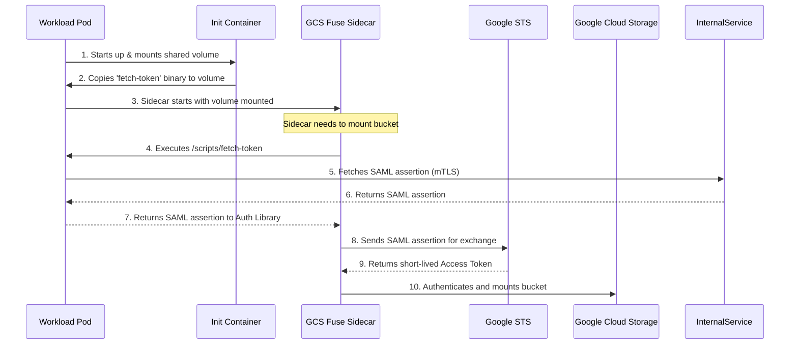

# Demo Guide: GCS Fuse Integration with Custom Token Fetcher (Option 1)

This guide outlines the steps, walkthrough, and talking script for demonstrating the Executable-Sourced Credentials flow for the GCS Fuse integration.

## Goal
Demonstrate how GCS Fuse can use a custom binary to fetch authentication tokens, avoiding the need for a sidecar container at this stage.

---

## Part 1: Walkthrough of Prepared Assets

In this part, you will show the audience the files we have prepared.

### 1. The Token Fetcher Go Source
Show the file [fetch_token.go](file:///usr/local/google/home/yangspirit/Work/gcs-fuse-csi-driver/poc/option1/base_demo/cmd/fetch_token/fetch_token.go).
*   **What to highlight**: Point out that it uses mTLS to connect to the internal token service (`https://10.128.0.2:5000/mint-cat`) and returns a SAML token in the format expected by Google Workload Identity Federation.

### 2. The Compiled Binary
Show that we have compiled this file into a statically linked binary named `fetch-token` in `poc/option1/base_demo/`.
*   **What to highlight**: Explain that it must be statically linked because the GCS Fuse sidecar image is distroless and lacks shared libraries or a package manager.

### 3. The Credential Configuration
Show the file [credential-configuration.json](file:///usr/local/google/home/yangspirit/Work/gcs-fuse-csi-driver/poc/option1/base_demo/credential-configuration.json).
*   **What to highlight**: Show the `credential_source` section where it specifies `executable` and points to `/scripts/fetch-token`. This tells the Google Auth library to run our binary to get the token.

### 4. The Deployment Manifest
Show the file [deployment.yaml](file:///usr/local/google/home/yangspirit/Work/gcs-fuse-csi-driver/poc/option1/base_demo/deployment.yaml).
*   **What to highlight**:
    *   The annotations that trigger the CSI driver webhook to inject the GCS Fuse sidecar and mount additional volumes.
    *   The `initContainers` section that copies the binary from the custom image to a shared volume.
    *   The `volumes` section defining the shared `emptyDir` volume.

---

## Part 2: Execution Steps for the Demo

*Note: These steps assume you are in a connected environment with access to a GKE cluster and the container registry. If this is a dry-run or simulated demo, you will just explain these steps.*

### Step 1: Create the ConfigMap
We need to store the `credential-configuration.json` in a ConfigMap so the CSI driver can mount it.

```bash
kubectl create configmap custom-auth-config --from-file=credential-configuration.json=poc/option1/base_demo/credential-configuration.json
```

### Step 2: Package and Push the Binary
The user needs to create a container image containing the `fetch-token` binary at `/usr/bin/fetch-token` and push it to their registry.

### Step 3: Deploy the Workload
Apply the deployment manifest.

```bash
kubectl apply -f poc/option1/base_demo/deployment.yaml
```

### Step 4: Verify Sidecar Injection
Check if the GCS Fuse sidecar was successfully injected into the Pod.

```bash
kubectl get pods -l app=gke-workload-with-gcsfuse -o jsonpath='{.items[0].spec.containers[*].name}'
```
*Expected output should include `gke-gcsfuse-sidecar`.*

### Step 5: Verify Mount Success
Check the logs of the GCS Fuse sidecar to ensure it started and mounted the bucket successfully.

```bash
kubectl logs -l app=gke-workload-with-gcsfuse -c gke-gcsfuse-sidecar
```
*Look for successful mount messages.*

---

## Part 3: Talking Script

**[Slide/Screen: Architecture Overview or showing `fetch_token.go`]**

"Hello everyone. Today I'm going to demonstrate the solution we've developed to unblock the V0 deployment of GCS Fuse.

The user has a unique security requirement: they use custom authentication mechanisms and encryption proxies. To support this without introducing a complex sidecar container right now, we are using **Option 1: Executable-Sourced Credentials**."

**[Action: Show `fetch_token.go`]**

"Here is the Go source code for the token fetcher. This code will be provided to the user. It connects to the internal token service via mTLS and returns a SAML response.

Because our GCS Fuse sidecar uses a secure, distroless image, this code must be compiled into a fully statically linked binary. We've done that here."

**[Action: Show `credential-configuration.json`]**

"Now, how do we tell GCS Fuse to use this binary? We use this `credential-configuration.json` file. Notice the `credential_source` block. Instead of a standard service account key or metadata server, it specifies an `executable` command: `/scripts/fetch-token`.

When GCS Fuse needs to authenticate, the Google Auth library inside it will execute this binary to get the token."

**[Action: Show `deployment.yaml`]**

"Finally, let's look at how this is deployed. We are using the **InitContainer pattern** to share the binary securely.

1.  The user packages their binary into a custom image.
2.  An `initContainer` runs first, mounting a shared `emptyDir` volume, and copies the binary into it.
3.  We use these specific annotations to tell our CSI driver webhook to inject the GCS Fuse sidecar AND mount that same shared volume into it.

This allows the distroless sidecar to access and execute the binary without insecure host mounts.

This solution preserves native audit lineage and unblocks the V0 deployment while we work on longer-term protocol compatibility initiatives."

---

## Part 4: Mock Demo (Self-Contained)

If you want to run a self-contained demo without access to the actual services, use the following assets we have prepared:

1.  **Mock Service**: [mock_service.go](file:///usr/local/google/home/yangspirit/Work/gcs-fuse-csi-driver/poc/option1/base_demo/cmd/mock_service/mock_service.go) (and compiled `mock-service`). Now includes `/sts-token` endpoint to simulate Google STS.
2.  **Mock Service Manifest**: [mock-service-deployment.yaml](file:///usr/local/google/home/yangspirit/Work/gcs-fuse-csi-driver/poc/option1/base_demo/mock-service-deployment.yaml) runs the mock service as a separate Deployment and Service.
3.  **Credential Configuration**: [mock-credential-configuration.json](file:///usr/local/google/home/yangspirit/Work/gcs-fuse-csi-driver/poc/option1/base_demo/mock-credential-configuration.json) points directly to the binary `/scripts/fetch-token`.
4.  **Demo Deployment**: [demo-deployment.yaml](file:///usr/local/google/home/yangspirit/Work/gcs-fuse-csi-driver/poc/option1/base_demo/demo-deployment.yaml) copies the binary in the `initContainer` and uses `gke-gcsfuse/inject-after: "copy-token-binary"` annotation to ensure correct execution order.

### Steps for Mock Demo:
1.  **Deploy the Mock Service**:
    ```bash
    kubectl apply -f poc/option1/base_demo/mock-service-deployment.yaml
    ```
2.  **Create the ConfigMap**:
    ```bash
    kubectl create configmap mock-auth-config --from-file=credential-configuration.json=poc/option1/base_demo/mock-credential-configuration.json -n default --dry-run=client -o yaml | kubectl apply -f -
    ```
3.  **Apply the Demo Deployment**:
    ```bash
    kubectl apply -f poc/option1/base_demo/demo-deployment.yaml
    ```
4.  **Verify**:
    *   Check mock service logs to see token requests: `kubectl logs -l app=mock-token-service`
    *   Check sidecar logs to see GCS authentication attempt: `kubectl logs -l app=gke-workload-with-gcsfuse-demo -c gke-gcsfuse-sidecar`
    *   Expect to see `ACCESS_TOKEN_TYPE_UNSUPPORTED` error from GCS, proving that the sidecar successfully executed the binary and used the mock token!

---

## Part 5: HostPath Alternative

If the user prefers not to package their binary in a container image and instead use a binary dropped on the host by their DaemonSet, you can demonstrate this alternative.

### Key Differences:
- No `initContainers` needed.
- Uses `hostPath` volume instead of `emptyDir`.
- Requires the binary to be **fully statically linked (ideally using the `musl` target)** because it executes inside the distroless sidecar container. Standard static builds on Linux still depend on `glibc` and may fail in distroless environments. If a dynamically linked binary must be used, the required shared libraries must also be mounted from the host, or a custom sidecar image containing those libraries must be used.

### Manifest:
Show [hostpath-deployment.yaml](file:///usr/local/google/home/yangspirit/Work/gcs-fuse-csi-driver/poc/option1/base_demo/hostpath-deployment.yaml).

### Steps for HostPath Demo:
1.  **Install the binary on host nodes** (Simulation):
    Apply the helper DaemonSet to copy the binary from our image to the host path:
    ```bash
    kubectl apply -f poc/option1/base_demo/install-hostpath-binary.yaml
    ```
2.  **Apply the HostPath Demo Deployment**:
    ```bash
    kubectl apply -f poc/option1/base_demo/hostpath-deployment.yaml
    ```
3.  **Verify**:
    Check sidecar logs to see GCS authentication attempt:
    ```bash
    kubectl logs -l app=gke-workload-with-gcsfuse-hostpath -c gke-gcsfuse-sidecar
    ```
    Expect to see the same `ACCESS_TOKEN_TYPE_UNSUPPORTED` error, proving it executed the binary from the host!

### Talking Script Addition:
"We also have an alternative for environments where packaging the binary in a container is not preferred. If the user uses a DaemonSet to distribute the binary to all nodes, we can mount it directly using a `hostPath` volume. This avoids the initContainer step but requires the binary to be present on the host. We have a helper DaemonSet to simulate this for the demo."

---

## Part 6: End-to-End Security & Identity Flow

This section explains how identity is established and permissions are enforced in this solution, addressing concerns about security isolation and privilege escalation.

### 1. End-to-End Flow



#### Option 1A: Init Container Flow
1.  **Workload Deployment**: The user deploys a workload Pod with a specific **Kubernetes Service Account (KSA)**.
2.  **Binary Copy**: An `initContainer` (running a custom image containing the token fetcher binary) starts, mounts a shared `emptyDir` volume, and copies the statically linked `fetch-token` binary into it.
3.  **Sidecar Injection**: The GCS Fuse CSI driver injects the GCS Fuse sidecar container. The shared volume is mounted into this sidecar.
4.  **Token Acquisition**: When GCS Fuse needs to access a bucket, the Google Auth library executes `/scripts/fetch-token` (the binary copied by the init container).
5.  **Internal Auth**: The `fetch-token` binary authenticates to the customer's internal token service (e.g., via mTLS or using the Pod's identity) and retrieves a **SAML assertion**.
6.  **Token Exchange**: GCS Fuse sends this SAML assertion to the **Google Security Token Service (STS)**.
7.  **Access Token**: STS verifies the SAML assertion and returns a short-lived Google Cloud access token.
8.  **GCS Access**: GCS Fuse uses this access token to authenticate to GCS and mount the bucket.

#### Option 1B: HostPath Flow
1.  **Binary Installation**: A DaemonSet installs the `fetch-token` binary on the host filesystem of all nodes.
2.  **Workload Deployment**: The user deploys a workload Pod with a specific **KSA**.
3.  **Volume Mount**: The Pod mounts the host path containing the binary.
4.  **Sidecar Injection**: The GCS Fuse sidecar is injected and can access the binary directly from the host path.
5.  **Token Flow**: The steps for acquiring the SAML token, exchanging it via STS, and accessing GCS are identical to the Init Container flow.

### 2. Identity Setup and Permissions

To ensure secure access and prevent unauthorized impersonation, the following configuration is required on the Google Cloud side:

#### A. Workload Identity Federation Setup
*   **Identity Pool**: The customer creates a dedicated Workload Identity Federation Pool for these workloads.
*   **Provider**: The customer adds a SAML provider to the pool, trusting the customer's internal identity provider.
*   **Audience Restriction**: The SAML tokens generated by the customer's service MUST have an audience field that matches the Workload Identity Federation pool URI. This ensures that a token generated for this flow cannot be used for other purposes (e.g., logging into the GCP Console).

#### B. Granting Permissions (Two Approaches)

Depending on the preferred model, permissions can be granted in two ways:

1.  **Direct Federated Identity (Recommended for Attribute-Based Access Control)**:
    *   Permissions are granted directly to the federated identity based on attributes in the SAML token (e.g., mapping a `bucket_name` attribute to access on that specific bucket).
    *   Example: Grant `roles/storage.objectViewer` to `principalSet://iam.googleapis.com/projects/PROJECT_NUMBER/locations/global/workloadIdentityPools/POOL_ID/attribute.pod_prefix/GKE_WORKLOAD_PREFIX`.
    *   **Security**: Access control is defined by attributes (like team, pod prefix, or target bucket) rather than a single shared identity. This allows for per-bucket granularity.

2.  **Service Account Impersonation**:
    *   The customer creates a standard **Google Service Account (GSA)** and grants it specific IAM roles on the bucket.
    *   The Workload Identity Federation pool is configured to allow the federated identity (matching specific SAML attributes) to impersonate that GSA.
    *   **Security**: Access is restricted to only the specific GSA mapped in the pool. If a user presents a SAML token with attributes that do not map to a allowed GSA, access is denied.

#### Prerequisites

Before proceeding with the setup, ensure the following infrastructure is in place:

1.  **Internal Token Service**: A functional internal service capable of minting SAML tokens based on requester identity.
2.  **Network Connectivity & mTLS**: The workload pods must have network access to this internal service. If using mTLS (as in the demo), appropriate certificates or service mesh configurations must be available to the Pod.
3.  **Workload Identity Federation**: A Workload Identity Pool and Provider must be created in your Google Cloud project.

#### C. Customer Setup Steps

To run this solution, the customer is responsible for creating the identity and granting permissions. Here is how they would do it:

1.  **Create the Kubernetes Service Account (KSA)**:
    *   The customer creates a KSA for the workload Pod.
    *   Example: `kubectl create serviceaccount my-workload-ksa -n my-namespace`
    *   *Note: This KSA provides the Pod's identity in the cluster. The GCS Fuse CSI driver depends on this KSA identity (via the CSI Token Requests feature) to authorize the volume mount operation, even though GCS Fuse will later use the custom SAML token for actual file access operations.*

2.  **Grant Permissions (IAM Policy Binding)**:
    *   If using the **Service Account Impersonation** approach: The customer creates a Google Service Account (GSA) and grants it IAM roles on the bucket. Then they configure the Workload Identity Federation pool to allow the federated identity (from SAML) to impersonate that GSA.
    *   If using the **Direct Federated Identity** approach: The customer grants IAM roles on the bucket directly to the `principalSet` representing the federated identity with specific attributes.

3.  **Deploy the Workload**:
    *   The customer uses the created KSA in their workload deployment manifest (`serviceAccountName: my-workload-ksa`).

### 3. Summary of Security Controls (How it Locks Things Down)

*   **No Long-Lived Keys**: No service account keys are stored in the cluster or on disk, eliminating the risk of credential theft via cluster compromise.
*   **Automatic Refresh**: The Google Auth library handles token refreshing automatically, minimizing the window of vulnerability for any single short-lived token.
*   **Audience Locking (Prevents Replay)**: Tokens are scoped strictly to the specific federation pool URI. This ensures that a token stolen from this flow cannot be used to access other Google Cloud services or resources.
*   **Least Privilege via ABAC**: By granting permissions based on specific attributes (like `pod_prefix`), access is restricted to only what is necessary for that specific workload, preventing broad, unauthorized access even within the same pool.
*   **Hard Isolation**: Segregating resources into different identity pools ensures that a compromise in one pool does not grant access to resources in another.
*   **Full Audit Traceability**: The unique subject identifier from the SAML token is recorded in Google Cloud audit logs for every operation. This ensures that even with dynamic token fetching and attribute-based access control, there is a clear audit trail linking actions to specific workloads.

---

## Part 7: C++ Dependency POC (Static Linking Solution)

This section describes how to run the demo showing that static linking solves the issue of missing C++ libraries in the distroless GCS Fuse sidecar.

### Goal
Prove that a binary statically linked against its custom C++ dependencies can run successfully in the distroless environment.

### Key to Success: Pure Static Linking with `musl`
> [!NOTE]
> By default, a static build on Linux still depends on `glibc`. To run successfully in the distroless sidecar (which may lack the glibc dynamic linker), we used the **`musl` target** in Rust (`x86_64-unknown-linux-musl`) to produce a truly zero-dependency binary.

### How it is Linked
To simulate the customer's C++ crypto library, we:
1.  Compiled `mock_crypto.cpp` into an object file.
2.  Archived it into a static library `libmockcrypto.a`.
3.  Linked it into the Rust binary using the `-l static=mockcrypto` flag.

This is the command executed in the builder environment:
```bash
g++ -c -fPIC mock_crypto.cpp -o mock_crypto.o
ar rcs libmockcrypto.a mock_crypto.o
rustc -L . -l static=mockcrypto -l stdc++ main.rs -o mock-client-static
```
*(Note: In the Init Container flow, this happens inside the cluster; in the HostPath flow, this happens in a local Docker container).*

### Assets Prepared in `cpp_poc/`:
1.  **Source Code**: `mock_crypto.cpp` (C++ library) and `main.rs` (Rust client).
2.  **Manifests**: `demo-cpp-initcontainer.yaml` and `demo-cpp-hostpath.yaml`.
3.  **Config**: `cpp-credential-configuration.json` and `cpp-source-config.yaml`.
4.  **Automation Scripts**: `run_cpp_initcontainer_demo.sh` and `run_cpp_full_hostpath_demo.sh`.

### Steps to Run the Demo:

#### Option A: Using Init Container (In-Cluster Compilation)
This option is self-contained and does not require local build tools or pushing images to a registry.
1.  **Navigate to directory**:
    ```bash
    cd poc/option1/cpp_poc
    ```
2.  **Run the script**:
    ```bash
    ./run_cpp_initcontainer_demo.sh
    ```
3.  **How it works**:
    *   The script creates a ConfigMap (`cpp-source-config`) containing the source files.
    *   It applies `demo-cpp-initcontainer.yaml`.
    *   The injected init container (using `rust:alpine` image) fetches the source files and **compiles them directly inside the cluster**, outputting the static binary to the shared volume.
4.  **Verify**:
    *   The script will automatically check logs. Expect to see:
        ```
        credentials: unable to parse "response": Rust wrapper starting...
        MOCK CRYPTO: Encrypting using C++ standard library (cout)...
        Rust wrapper finished.
        ```
        *Note: The "unable to parse response" error is expected because our mock binary does not return valid token JSON. The success is that it executed without library errors.*

#### Option B: Using HostPath (Full Image Build)
This option simulates the production flow where you build the binary locally, package it in an image, and distribute it via DaemonSet.
1.  **Prerequisite**: Ensure you are authenticated to your container registry (e.g., `gcloud auth configure-docker`).
2.  **Navigate to directory**:
    ```bash
    cd poc/option1/cpp_poc
    ```
3.  **Run the full script**:
    ```bash
    ./run_cpp_full_hostpath_demo.sh
    ```
4.  **How it works**:
    *   The script runs `make static` locally (using `musl` target) to build the binary.
    *   It builds a Docker image and pushes it to the registry.
    *   It deploys a DaemonSet to copy the binary from the image to `/var/lib/custom/bin` on all nodes.
    *   It deploys the workload Pod, which mounts that host path.
5.  **Verify**:
    *   Expect the same successful execution output as in Option A.

